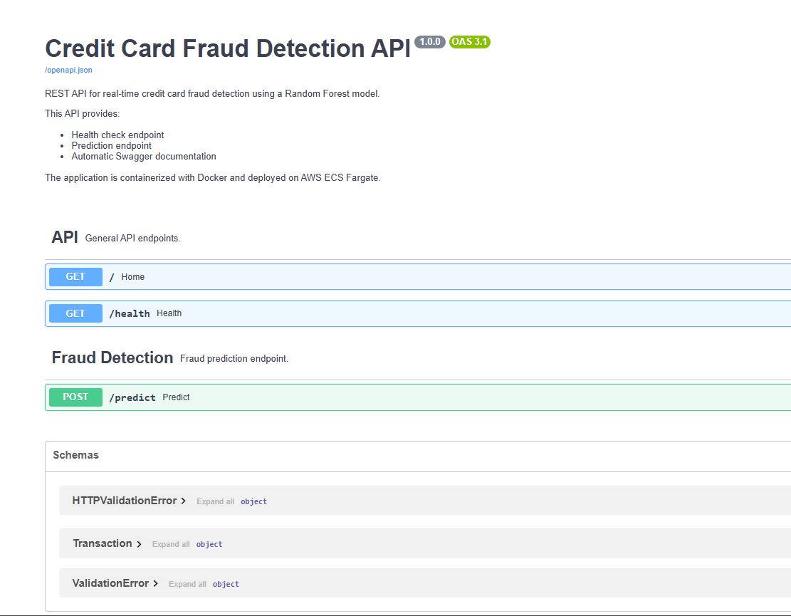
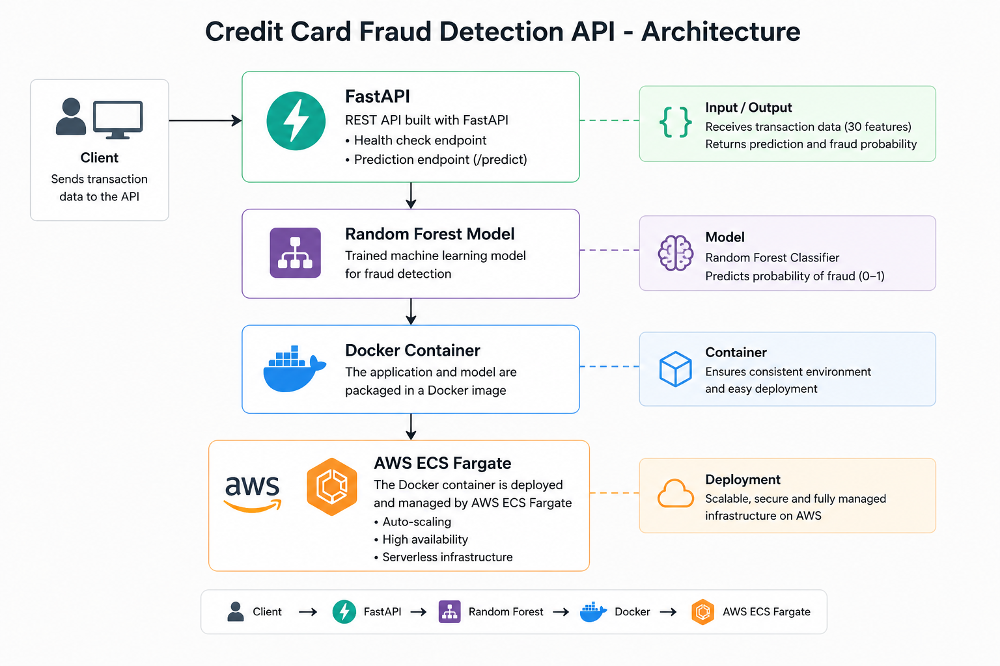
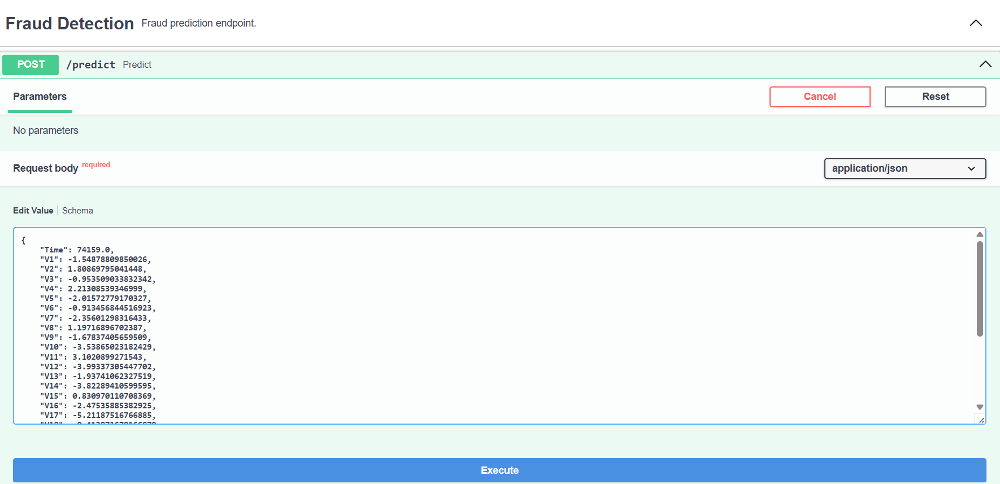
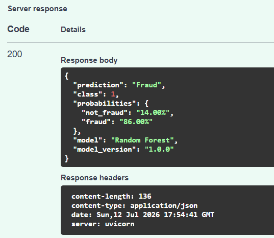
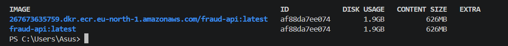
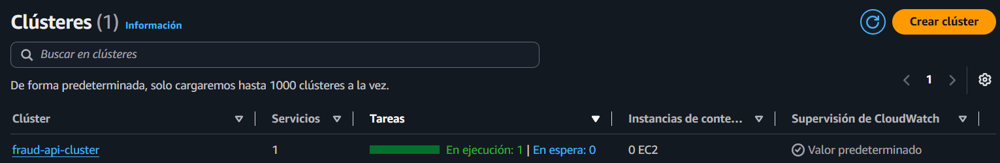
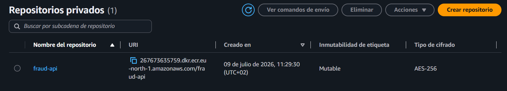

## 💳 Credit Card Fraud Detection System

<p align="center">


</p>

---

## 🚀 Project Overview

This project implements an **end-to-end Credit Card Fraud Detection System** using Machine Learning and modern software engineering practices.

The objective is not only to train a predictive model, but also to simulate a production-ready environment by exposing the model through a REST API, containerizing the application with Docker, and deploying it on AWS ECS Fargate.

The system receives transaction data, predicts whether the transaction is fraudulent, and returns both the predicted class and fraud probability.


---

## ✨ Key Features

- End-to-End Machine Learning Pipeline
- Random Forest Classifier for Fraud Detection
- REST API built with FastAPI
- Interactive Swagger / OpenAPI Documentation
- Docker Containerization
- AWS ECS Fargate Deployment
- Production-ready Project Structure

---

## 🌐 Interactive API Documentation

<p align="center">

</p>

The REST API was developed with **FastAPI**, providing:

- Interactive Swagger documentation
- Automatic OpenAPI specification
- Health monitoring endpoint
- Fraud prediction endpoint
- JSON request/response format

---

## 💼 Business Problem

Credit card fraud represents one of the most important financial risks for banks and payment processors.

A major challenge is the **extreme class imbalance**, where fraudulent transactions represent only a very small percentage of the total operations.

Traditional accuracy metrics become misleading under these conditions. Therefore, the objective is to maximize fraud detection while minimizing false positives.

The implemented solution aims to provide an inference service capable of classifying incoming transactions in real time.

---

## 🏗 System Architecture

<p align="center">

</p>

The architecture follows a simple production-oriented workflow:

1. A client sends a transaction to the REST API.
2. FastAPI validates the incoming request.
3. The Random Forest model performs inference.
4. The prediction is returned as JSON.
5. The application runs inside a Docker container.
6. The container is deployed on AWS ECS Fargate.

---

## 🛠 Technology Stack

| Category | Technologies |
|-----------|--------------|
| Language | Python 3.14.6 |
| Machine Learning | Scikit-Learn |
| Model | Random Forest Classifier |
| Data Processing | Pandas, NumPy |
| API | FastAPI |
| Validation | Pydantic |
| Documentation | Swagger / OpenAPI |
| Containerization | Docker |
| Cloud Deployment | AWS ECS Fargate |
| Registry | Amazon ECR |
| Version Control | Git & GitHub |

---

## 📊 Dataset

The project uses the **Credit Card Fraud Detection** dataset available on Kaggle.

> **Source:** https://www.kaggle.com/datasets/mlg-ulb/creditcardfraud

The dataset contains **284,807 credit card transactions**, including only **492 fraudulent transactions**, representing approximately **0.17%** of the observations.

This severe class imbalance makes fraud detection a challenging binary classification problem.

#### Dataset Features

| Feature | Description |
|----------|-------------|
| Time | Seconds elapsed between each transaction and the first transaction |
| Amount | Transaction amount |
| V1 - V28 | PCA-transformed anonymized features |
| Class | Target variable (0 = Legitimate, 1 = Fraud) |

> **Note:** The original dataset is not included in this repository due to its size. Download the dataset from Kaggle and place the `creditcard.csv` file inside the `data/` directory.

---

## 📁 Project Structure

```text
credit-card-fraud-detection-system/
│
├── data/
│   └── creditcard.csv
│
├── images/
│   ├── 01_swagger_home.png
│   ├── 02_predict_endpoint.png
│   ├── 03_prediction_response.png
│   ├── 04_aws_ecs_cluster.png
│   ├── 05_ecr_repository.png
│   ├── 06_docker_images.png
│   └── 07_architecture.png
│
├── notebooks/
│   ├── 01_eda.ipynb
│   ├── 02_cleaning.ipynb
│   ├── 03_feature_engineering.ipynb
│   ├── 04_modeling.ipynb
│   ├── 05_evaluation.ipynb
│   └── 06_production.ipynb
│
├── app.py
├── Dockerfile
├── modelo_fraude.pkl
├── requirements.txt
├── sample_request.json
├── sample_request_fraud.json
└── README.md
```

---

## 🔬 Machine Learning Pipeline

The project follows a complete end-to-end Machine Learning workflow.

#### 1. Exploratory Data Analysis (EDA)

- Dataset inspection
- Missing value analysis
- Target distribution
- Feature visualization
- Class imbalance analysis

---

#### 2. Data Cleaning

- Data validation
- Duplicate inspection
- Feature consistency verification

---

#### 3. Feature Engineering

- Feature scaling
- Amount normalization
- Dataset preparation for training

---

#### 4. Model Training

Several machine learning algorithms were evaluated before selecting the final model.

Models evaluated include:

- Logistic Regression
- Random Forest
- XGBoost

The final production model is a **Random Forest Classifier**.

---

#### 5. Model Evaluation

Because of the highly imbalanced dataset, multiple evaluation metrics were considered instead of relying only on accuracy.

Metrics evaluated:

- Precision
- Recall
- F1-Score
- ROC-AUC
- Precision-Recall AUC (PR-AUC)


### 📈 Final Model Performance

Three machine learning algorithms were evaluated during the modeling stage: **Logistic Regression**, **Random Forest**, and **XGBoost**.

The models were evaluated using **Recall, Precision, F1-Score, ROC-AUC, and Precision-Recall AUC (PR-AUC)**, providing a comprehensive assessment of classification performance on a highly imbalanced dataset.

| Model | Recall | Precision | F1-Score | ROC-AUC | PR-AUC |
|-------|-------:|----------:|---------:|--------:|--------:|
| Logistic Regression | 0.58 | 0.85 | 0.69 | **0.953** | 0.690 |
| **Random Forest** | **0.73** | **0.97** | **0.83** | 0.924 | **0.797** |
| XGBoost | 0.69 | 0.75 | 0.72 | 0.857 | 0.694 |

#### Why Random Forest?

Although **Logistic Regression** achieved the highest **ROC-AUC** score, **Random Forest** delivered the best overall performance on the metrics that matter most for fraud detection.

| Model | Precision | Recall | F1-Score |
|-------|----------:|-------:|---------:|
| Logistic Regression | 0.85 | 0.58 | 0.69 |
| **Random Forest** | **0.97** | **0.73** | **0.83** |
| XGBoost | 0.75 | 0.69 | 0.72 |

Random Forest achieved:

- ✅ Highest Recall
- ✅ Highest Precision
- ✅ Best F1-Score
- ✅ Best PR-AUC
- ❌ ROC-AUC was only surpassed by Logistic Regression.

However, **ROC-AUC can be overly optimistic when evaluating extremely imbalanced datasets**, such as credit card fraud detection, where fraudulent transactions represent only a very small fraction of the observations.

For this type of problem, **PR-AUC, Recall, Precision, and F1-Score provide a more representative evaluation of the model's ability to identify fraudulent transactions while minimizing false positives.**

For these reasons, **Random Forest was selected as the final production model**, as it provided the best overall balance between fraud detection performance, robustness, and generalization.

---

## 🌐 REST API

The trained Random Forest model is exposed through a REST API built with **FastAPI**.

The API provides:

- Health monitoring endpoint
- Fraud prediction endpoint
- Automatic Swagger documentation
- OpenAPI specification
- JSON request and response format

---


### 🔍 Prediction Endpoint

<p align="center">

</p>

The prediction endpoint receives a transaction in JSON format and returns:

- Predicted class
- Fraud probability
- Model information

---

### ✅ Example Prediction

<p align="center">

</p>

Actual response obtained from the deployed API:

- **Prediction:** Fraud
- **Class:** 1
- **Fraud Probability:** **86%**
- **Not Fraud Probability:** **14%**


---

## 📡 API Endpoints

| Method | Endpoint | Description |
|---------|----------|-------------|
| GET | `/` | API information |
| GET | `/health` | Health check |
| POST | `/predict` | Fraud prediction |

---

## 🐳 Docker

The application is fully containerized using Docker, ensuring portability and reproducibility across different environments.

<p align="center">

</p>

The application can be started locally using:

```bash
docker build -t fraud-api .
docker run -p 8000:8000 fraud-api
```

---

## ☁️ AWS Deployment

The application is deployed on **Amazon Web Services (AWS)** using **Elastic Container Service (ECS) with Fargate**.

Deployment components:

- Amazon ECS
- AWS Fargate
- Amazon ECR
- Docker Container
- Public REST API

---

### Amazon ECS Cluster

<p align="center">

</p>

The application runs as an ECS Service, allowing container orchestration without managing servers.

---

### Amazon ECR

<p align="center">

</p>

The Docker image is stored in **Amazon Elastic Container Registry (ECR)** and automatically deployed through ECS Task Definitions.

---

## 🚀 Running the Project

Requirements:

- Python 3.14.6
- Docker (optional)

Clone the repository:

```bash
git clone https://github.com/mauriciocasanovas/credit-card-fraud-detection-system

cd credit-card-fraud-detection-system
```

Install dependencies:

```bash
pip install -r requirements.txt
```

Download the Kaggle dataset and place `creditcard.csv` inside the `data/` folder.

Start the API:

```bash
uvicorn app:app --reload
```

Swagger UI:

```text
http://127.0.0.1:8000/docs
```

---

## 📌 Conclusion

This project demonstrates the complete lifecycle of a Machine Learning application, from data exploration and model development to deployment using FastAPI, Docker and AWS ECS Fargate.

It combines data science, software engineering and cloud technologies to simulate a production-ready fraud detection system.

**The result is a complete end-to-end machine learning project that reflects real-world development and deployment practices.**

---

## 👨‍💻 Author

**Mauricio Javier Casanovas Juárez**

GitHub: https://github.com/mauriciocasanovas

---

